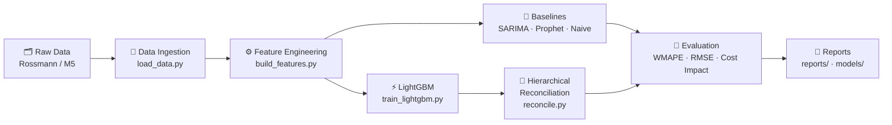

<div align="center">

# 📦 Demand Forecasting
### Retail SKU-Level Sales Prediction

[](https://python.org)
[](https://lightgbm.readthedocs.io)
[](https://facebook.github.io/prophet/)
[](https://www.statsmodels.org)
[](LICENSE)

*Store/SKU-level demand forecasting on **Rossmann** / **M5** retail sales data.*

</div>

---

## 🎯 Overview

This pipeline engineers **lag, rolling-window, seasonality, and promotion/holiday features**, trains a **LightGBM global model**, benchmarks it against **SARIMA/Prophet baselines**, and applies **hierarchical reconciliation** to keep store-level forecasts consistent with regional totals.

**Tech Stack:** `Python` · `LightGBM` · `statsmodels (SARIMA)` · `Prophet` · `pandas` · `scikit-learn`

---

## 📊 Results

| Model | WMAPE | Notes |
|:------|:-----:|:------|
| 📅 Seasonal-naive baseline | `XX%` | Same weekday, previous cycle |
| 📈 SARIMA | `XX%` | Per-series, statsmodels |
| 🔮 Prophet | `XX%` | Per-series, holiday regressors |
| **⚡ LightGBM (final)** | **`XX%`** | Global model, lag/rolling/seasonal features |

> [!NOTE]
> Estimated **XX% reduction in stockout/overstock cost** at scale — see [`reports/cost_impact.md`](reports/cost_impact.md) for the costing methodology. Hierarchical reconciliation (bottom-up / MinT) keeps SKU → store → region forecasts additive and consistent.

> [!TIP]
> Replace the `XX%` placeholders in this table and in `reports/` once you've run the pipeline end-to-end on your chosen dataset (Rossmann or M5).

---

## 🔄 Pipeline Overview



### Step-by-step

| # | Stage | Module | Description |
|:-:|:------|:-------|:------------|
| 1 | **Data Ingestion** | `src/data/load_data.py` | Load raw Rossmann or M5 CSVs, dtype fixes, missing flags, calendar joins |
| 2 | **Feature Engineering** | `src/features/build_features.py` | Lag features, rolling windows, calendar/seasonality, promo/holiday flags |
| 3 | **Baselines** | `src/models/baseline_*.py` | Seasonal-naive, per-series SARIMA, Prophet with holiday regressors |
| 4 | **LightGBM** | `src/models/train_lightgbm.py` | Global model with categorical encoding, early stopping, Optuna HPO |
| 5 | **Reconciliation** | `src/models/reconcile.py` | Bottom-up / MinT trace minimization for consistent hierarchical forecasts |
| 6 | **Evaluation** | `src/evaluation/metrics.py` | WMAPE, MAPE, RMSE, bias, cost-impact estimate |

<details>
<summary><b>📐 Feature Engineering Details</b></summary>

- **Lag features:** `sales_lag_{7, 14, 28}`
- **Rolling windows:** rolling mean/std over 7/14/28/90-day windows *(shifted to avoid leakage)*
- **Calendar/seasonality:** day-of-week, week-of-year, month, `is_weekend`, `days_to_next_holiday`
- **Promotion/holiday:** promo flags, state/school holidays, promo interval features

</details>

---

## 🗂️ Project Structure

```
demand-forecasting/
├── 📄 README.md
├── 📦 requirements.txt
├── 🚫 .gitignore
├── configs/
│   └── config.yaml            # paths, feature flags, model hyperparameters
├── data/
│   ├── raw/                   # untouched source files (Rossmann / M5) — gitignored
│   └── processed/             # cleaned, feature-engineered parquet/csv — gitignored
├── notebooks/
│   ├── 01_eda.ipynb            # exploratory data analysis
│   ├── 02_baselines.ipynb      # SARIMA / Prophet baselines
│   └── 03_lightgbm.ipynb       # model development & tuning
├── src/
│   ├── data/
│   │   └── load_data.py        # download/read raw Rossmann or M5 data
│   ├── features/
│   │   └── build_features.py   # lag, rolling-window, seasonality, promo/holiday features
│   ├── models/
│   │   ├── baseline_naive.py   # seasonal-naive baseline
│   │   ├── baseline_sarima.py  # SARIMA baseline (statsmodels)
│   │   ├── baseline_prophet.py # Prophet baseline
│   │   ├── train_lightgbm.py   # LightGBM training + hyperparameter search
│   │   └── reconcile.py        # hierarchical reconciliation (bottom-up / MinT)
│   ├── evaluation/
│   │   └── metrics.py          # WMAPE, MAPE, RMSE, bias, cost-impact estimate
│   └── utils/
│       └── io.py               # config loading, logging setup
├── models/                     # saved model artifacts (.pkl / .txt) — gitignored
├── reports/
│   ├── figures/                # saved plots (feature importance, forecast vs actual)
│   └── cost_impact.md          # stockout/overstock cost methodology & results
└── tests/
    ├── test_features.py
    └── test_metrics.py
```

---

## 🚀 Getting Started

### Prerequisites

- Python 3.8+
- A Kaggle account for downloading datasets

### Installation & Setup

```bash
# 1. Clone the repo and create a virtual environment
git clone <your-repo-url>
cd demand-forecasting
python -m venv .venv && source .venv/bin/activate  # Windows: .venv\Scripts\activate

# 2. Install dependencies
pip install -r requirements.txt

# 3. Place raw data
# Rossmann → https://www.kaggle.com/c/rossmann-store-sales
# M5       → https://www.kaggle.com/c/m5-forecasting-accuracy
# Download and unzip into data/raw/
```

### Running the Pipeline

```bash
# Step 1 — Load & clean raw data
python -m src.data.load_data --config configs/config.yaml

# Step 2 — Engineer features
python -m src.features.build_features --config configs/config.yaml

# Step 3 — Train baselines
python -m src.models.baseline_sarima  --config configs/config.yaml
python -m src.models.baseline_prophet --config configs/config.yaml

# Step 4 — Train LightGBM
python -m src.models.train_lightgbm  --config configs/config.yaml

# Step 5 — Reconcile hierarchically
python -m src.models.reconcile       --config configs/config.yaml
```

> [!NOTE]
> Outputs (metrics tables, forecast plots, trained model artifacts) land in `reports/` and `models/`.

---

## ⚙️ Configuration

All paths, date ranges, feature toggles, and LightGBM hyperparameters live in [`configs/config.yaml`](configs/config.yaml) so experiments are fully reproducible without touching source code.

```yaml
# Example config.yaml structure
dataset:
  name: rossmann   # or "m5"
  raw_path: data/raw/
  processed_path: data/processed/

features:
  lags: [7, 14, 28]
  rolling_windows: [7, 14, 28, 90]

model:
  n_estimators: 1000
  learning_rate: 0.05
  # ... additional LightGBM params
```

---

## 📝 Notes

> [!IMPORTANT]
> This scaffold is **dataset-agnostic** — set `dataset.name` in `configs/config.yaml` to switch between Rossmann and M5 without code changes.

- ⏱️ **Time-based (rolling-origin) cross-validation** is used throughout to avoid data leakage from future periods into training folds.
- 🔢 All `XX%` placeholders should be replaced with actual measured results once the pipeline has been run against real data.
- 🔗 **Hierarchical reconciliation** ensures that forecasts at the SKU level sum correctly to store and region totals — critical for supply chain planning.
